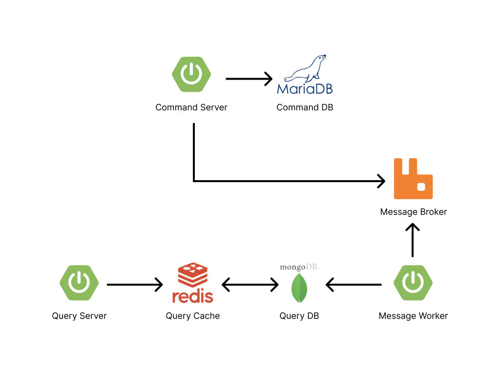

# CQRS Demo Application

## Docker Compose
Project Root 에 `docker-compose.yml` 이 있음.

내부 이미지는 아래와 같음

- MariaDB : Command 용 DB
- MongoDB : Query 용 DB
- Redis : Query 용 캐시
- RabbitMQ : 메시지 브로커

이 부분에서는 해당 프로젝트에 필요한 어플리케이션을 작성해두었음.

### 실행방법
`/sh/docker_compose_run.sh` 쉘을 실행

### 종료방법
`/sh/docker_compose_stop.sh` 쉘을 실행

## 구현

### 기능 명세
- 상품이 등록되면 해당 정보로 조회가 가능해야 한다.
- 상품이 수정되면 해당 정보로 조회가 가능해야 한다.
- 상품이 삭제되면 해당 정보로 조회가 되면 안된다.

### 상세 구현
**[등록, 수정, 삭제]**
1. 모든 Command Operations 는 Command Server 에서 수행된다.
2. 명령이 이루어지면 등록, 수정, 삭제 Event 를 Message Broker 에 발행한다.
3. Consume 하고 있는 Message Worker 는 해당 Event 의 Value 를 통해 Command Server 에 Get Read Model API 를
호출하여 읽기 전용 모델을 가져온 후 Query DB(MongoDB) 에 저장한다.
4. QueryDB 에 저장이 되면 Query Cache(Redis) 에 Key-Value 로 캐싱된다.

**[조회]**
1. Query Server 를 통해 조회 요청이 들어오면 Query Cache(Redis) 에 데이터를 가져온다.
2. 데이터가 있으면 Return, 없다면 Query DB(MongoDB) 에서 데이터를 가져온 후 Query Cache 에 캐싱 후 Return.
3. 만약 두 저장소 모두 데이터가 없다면 해당 데이터의 Key 값을 에러 테이블에 저장 (이후 데이터 정합성을 맞추기 위한 배치 작업 등에 사용할 예정) 후 예외 발생.